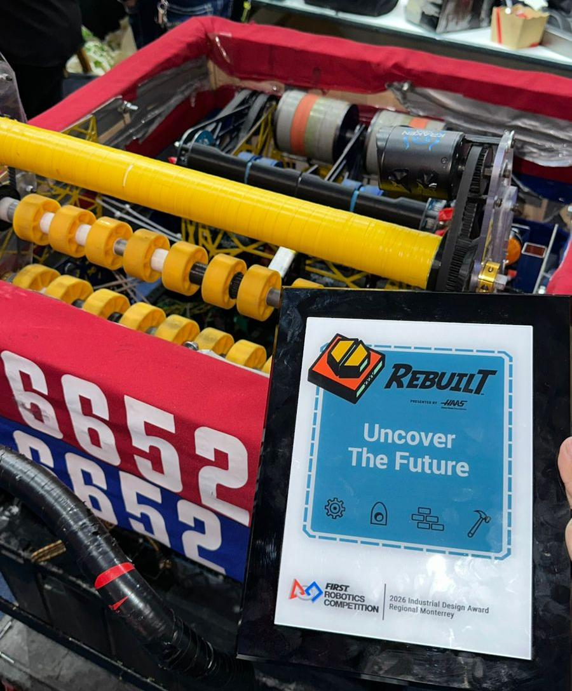

# Monterrey-2026-Tigres6652
Este es el código correspondiente a la versión 1.3.2, desarrollado para su uso en el regional de Monterrey 2026 por el equipo Tigres 6652, dentro de la competencia FIRST Robotics Competition (FRC).

