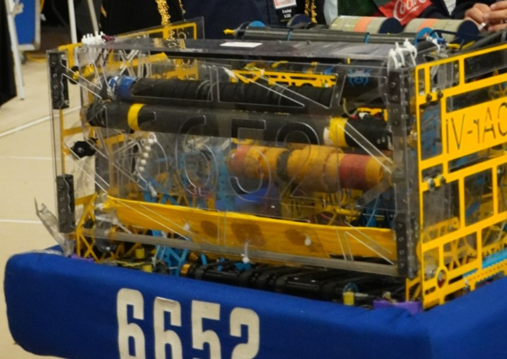

# Denver-2026-Tigres6652
Este es el código correspondiente a la versión 1.5.1, desarrollado para su uso en el regional de Denver 2026 por el equipo Tigres 6652, dentro de la competencia 
FIRST Robotics Competition (FRC).


# Denver-2026-Tigres6652

<p align="center">
  
</p>

<p align="center">
  
  
  
  
</p>

---
## Overview

This repository contains the official robot code developed by **Tigres 6652** for the
FIRST Robotics Competition (FRC) 2026 season.

The software was created for the Regional event in Denver, and is designed
with a modular, command-based architecture focused on reliability, maintainability, and
high-performance competition execution.

The robot features a **swerve drivetrain**, **Limelight 3A vision integration**, and
advanced autonomous capabilities powered by PathPlanner. It also includes assisted
teleoperated routines and automated scoring mechanisms to improve consistency during matches.

This codebase is continuously developed and optimized to support both driver control
and fully autonomous performance on the field.

---

## Key Features

- **Limelight 3A Vision System** – Camera system used for AprilTag detection, enabling accurate pose estimation and precise field alignment.

- **Automated Mechanism Control** – Subsystems execute automated scoring sequences, improving consistency and reducing driver workload.

- **PathPlanner Autonomous System** – Uses PathPlanner to generate and follow smooth autonomous trajectories for reliable match performance.

- **Teleop Assist Routines** – Driver-activated buttons that trigger assisted routines, such as automatically driving to predefined field positions.

- **Auto Aiming to HUB** – Vision-assisted targeting system that automatically aligns the robot with the scoring HUB for fast and accurate scoring.

- **Swerve Drive Control** – Full omnidirectional drivetrain enabling precise movement, rotation, and field-relative driving.

---

## Project Structure

```
src/main/java/frc/robot/
├── commands/       # Command-based robot actions
├── generated/      # Robot-wide constants
├── subsystems/     # Hardware abstraction layers
├── util/           # Utility classes
└── Robot.java      # Main robot entry point
```

## Technologies Used

This project is built using the following tools and frameworks:

- **Java** – Primary programming language used for robot software development.
- **WPILib** – Official open-source library provided for developing FRC robot code.
- **PathPlanner** – Advanced trajectory generation and autonomous path following tool.
- **Limelight** – Vision camera system used for AprilTag detection, robot pose estimation, and autonomous alignment.
- **AdvantageKit** – Logging and telemetry framework used for recording robot data, debugging, and analyzing system performance during and after matches.